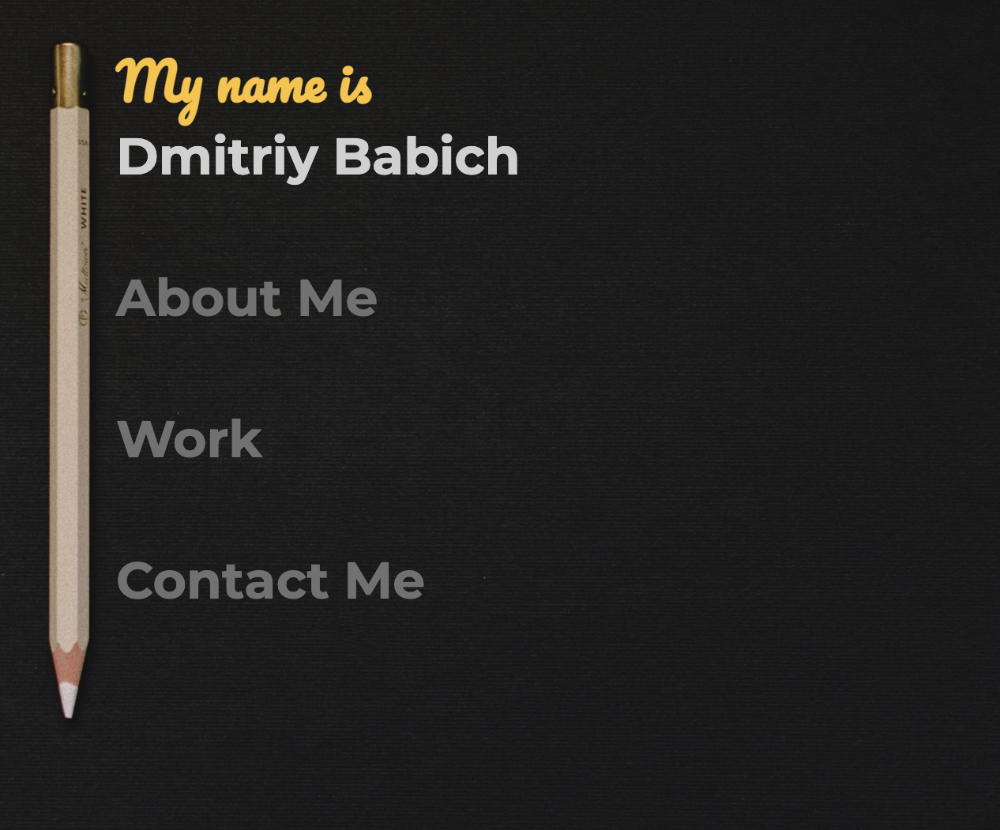
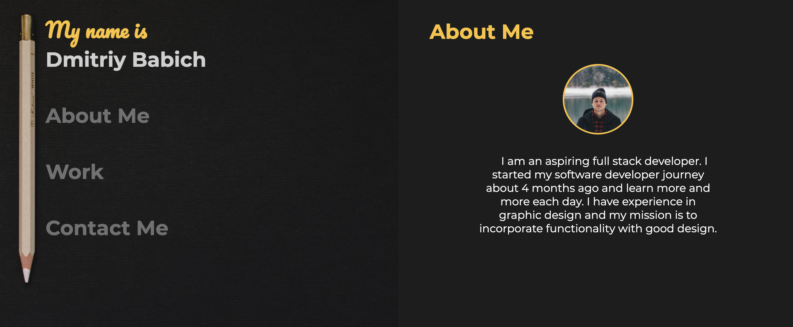
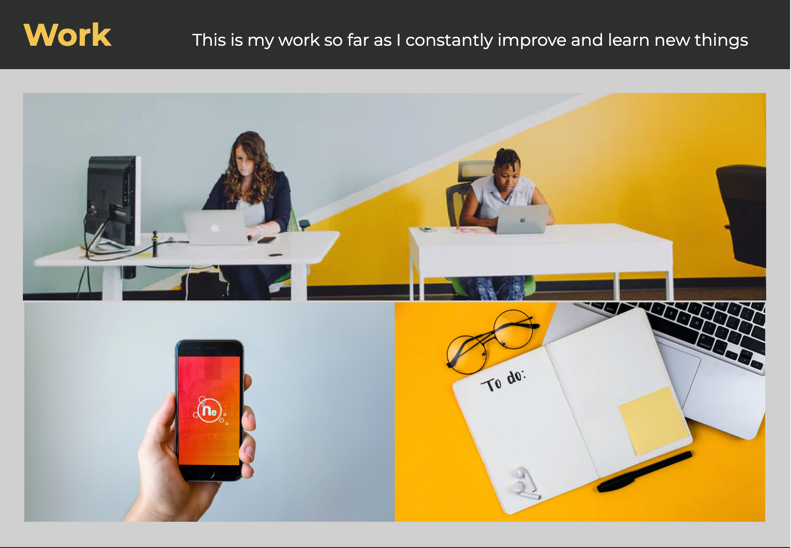
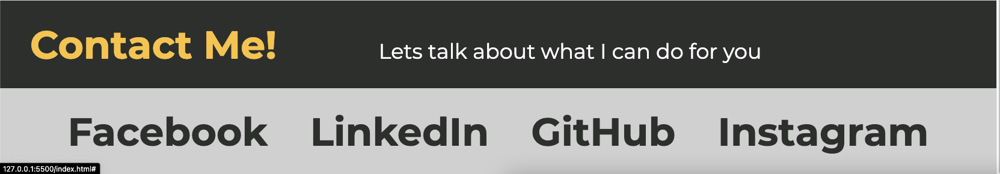
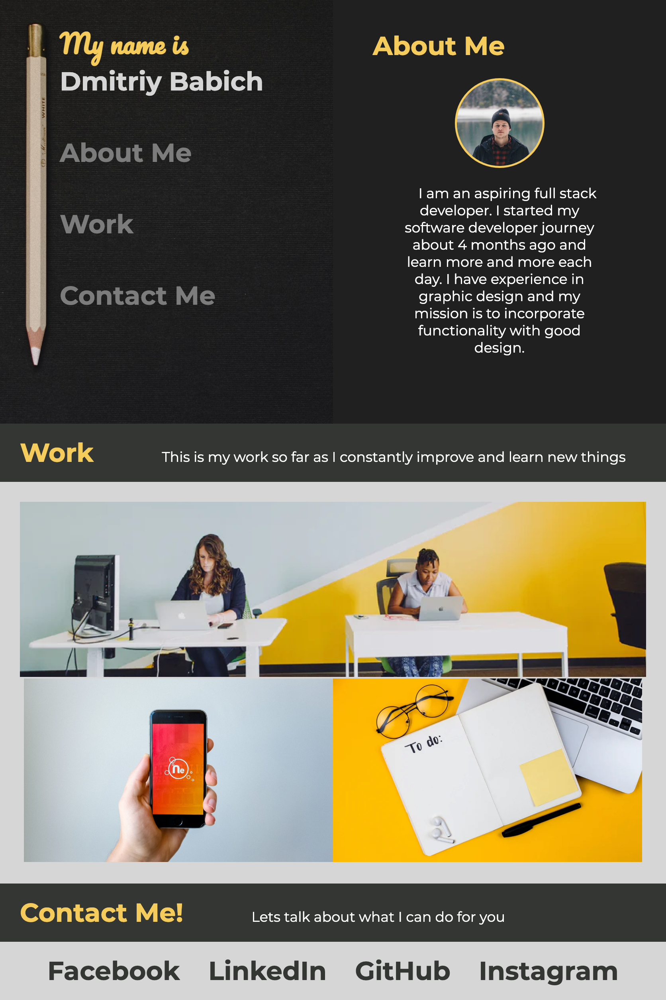
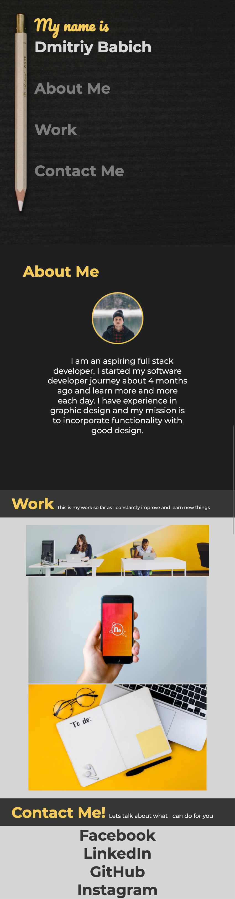
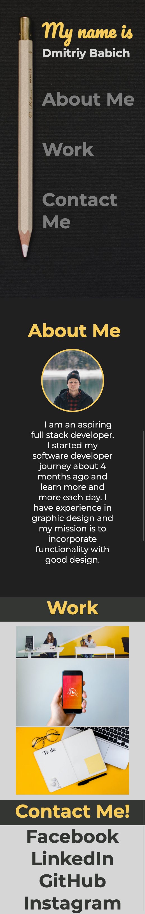
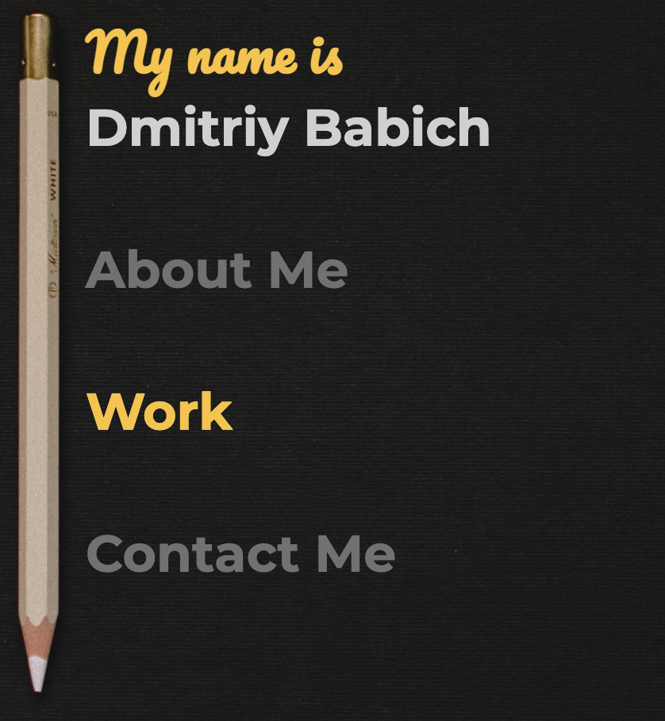
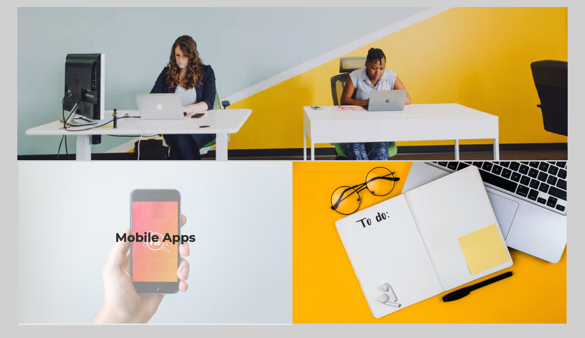

# Dmitriy Babich web-portfolio

## Description 
  This is a website portfolio that will be used to showcase my work to potential employers or clients.
So far its a simple layout made only using HTML and CSS. I hope to add projects and more features to the page as i learn more.

## Features 

- The page has a nav with 3 buttons which lead to the 3 main sections 
 

- The about me page is to the right of the nav but moves down below the nav on a smaller viewport

- The work section is a flex grid with one card being double the size of the other 2 

 - The contacts section is a inline list of links 

## responsive

The page is responsive and will move and hide certain elements as the viewport changes

### Desktop view

### Tablet view

### Mobile view

## animations

I added simple animations like hover on links and a fade animation to the grid cards

### Hover 

### Fade 
